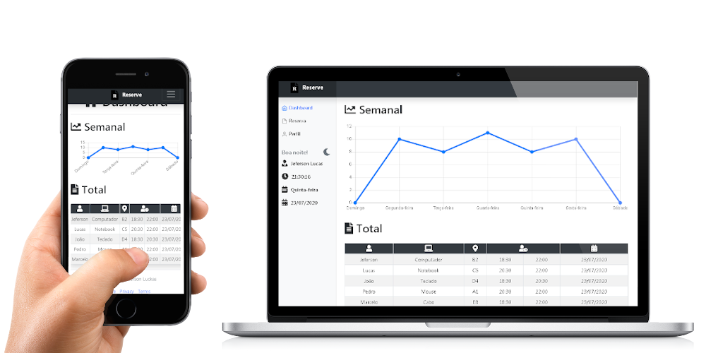

<h1 align="center">Reserve</h1>

<p align="center">
  
</p>
    <p align="center"><em>Tenha sempre o controle fácil, rápido e seguro das suas reservas.</em></p>    
    <p align="center">
        
        
        
        
        
        
  	</p>
</p>
<p align="center">
    
</p>

## Traduções

* :brazil: [Original](https://github.com/JefersonLucas/reserve/blob/master/README.md)
* :us: [English](https://github.com/JefersonLucas/reserve/blob/master/translations/en/README.md)

## Sobre

O Reserve é um aplicativo de reservas que utiliza as funcionalidades da API - localStorage do navegador para armazenamento das informações, sendo possível efetuar inserção, leitura, edição e remoção das reservas efetuadas. Com esse aplicativo será possível:

- [x] Cadastrar;
- [x] Filtrar;
- [x] Visualizar;
- [x] Editar;
- [x] Excluir; e
- [x] Imprimir reservas.

## Começando

Essas instruções fornecerão uma cópia do projeto em execução na sua máquina local.

### Instalando

Siga passo a passo as seguinte formas de obter o código na sua máquina local.

#### Clonando o repositório

Inicie o repositorio na sua máquina local utilizando as seguintes linhas de comando.

```
// Clonar com SSH

mkdir reserve
cd reserve
git init
git clone git@github.com:JefersonLucas/reserve.git
```

```
// Clonar com HTTPS

mkdir reserve
cd reserve
git init
git clone https://github.com/JefersonLucas/reserve.git
```
Agora os arquivos que estão no repositório remoto estão clonados no repositório local.

#### Baixando o repositório

Você também pode [baixar](https://github.com/JefersonLucas/reserve/archive/master.zip) o repositório em formato zip.

## Ambiente

Veja aqui o a página desse projeto implantado por @github-pages [ver implantação](https://jefersonlucas.github.io/reserve/).

## Como funciona?

Leia a nossa [Wiki](https://github.com/JefersonLucas/reserve/wiki) para obter mais informações.

## Construído com

* [Bootstrap](https://getbootstrap.com/) - Framework front end.
* [Font Awesome](https://maven.apache.org/) - Framework de pacote de ícones.

## Contribuindo

Leia o [CONTRIBUTING.md](https://github.com/JefersonLucas/reserve/blob/master/CONTRIBUTING.md) para obter detalhes sobre nosso código de conduta e o processo para enviar solicitações pull para nós.

## Versionamento

Usamos o [SemVer](https://semver.org/lang/pt-BR/) para controle de versão. Para as versões disponíveis, consulte as [tags nesse repositório](https://github.com/JefersonLucas/reserve/tags).

## Autores

* [@JefersonLucas](https://github.com/JefersonLucas) - _Idealizador_.

Veja também a lista completa de [contribuidores](https://github.com/JefersonLucas/reserve/contributors) que participaram deste projeto.

## Licença

Este projeto está licenciado sob a licença MIT - consulte o arquivo [LICENSE.md](https://github.com/JefersonLucas/reserve/blob/master/LICENSE) para obter detalhes.

## Agradecimentos

Meus sinceros agradecimentos:

* Primeiramente a Deus. 
* Meus sinceros agradecimentos a todos que visitam o projeto e deixa uma estrela como reconhecimento.
* Ao meu professor [Jorge Sant Ana](https://twitter.com/jorgesantanabr) pela inspiração.
